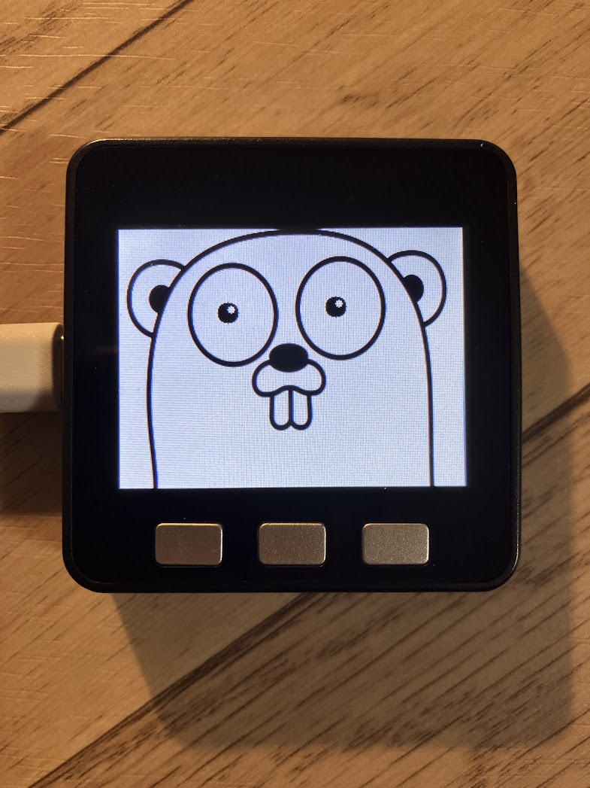

# tinygo-gopher-avator



M5Stackを利用したスタックチャンのavatorをGopher + TinyGoにしました

https://github.com/stack-chan/m5stack-avatar

M5Stackを用意して以下のコマンドで書き込みます

```
$ tinygo flash --target m5stack examples/basics/main.go
```

TN液晶のM5Stackの場合は以下のコマンドで書き込みます

```
$ tinygo flash -target m5stack -tags tn ./examples/basics/main.gp
```
